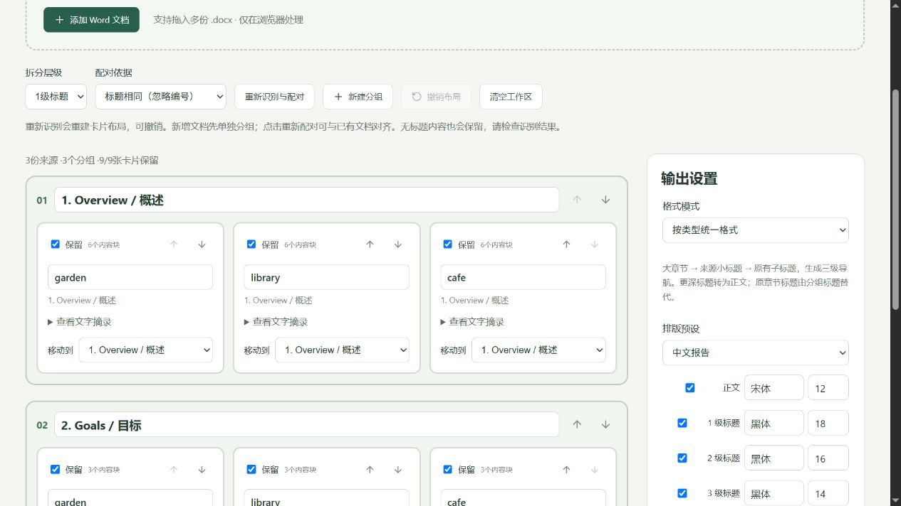

<div align="center">

# Word Merge Studio

**Compare drafts. Assemble chapters. Bring matching sections together.**

Local-first · Editable DOCX · 中文 / English · MIT

[中文](README.md) · **English** · [Examples](examples/README.md) · [Section guide](docs/SECTIONS.md)

</div>



Word Merge Studio is a browser-based workbench for the awkward part of document collaboration: choosing text without losing control of formatting, and turning separate reports into one readable Word document.

No account, document upload, AI key or backend is required. Files are processed in your browser. Downloading dependencies on first setup requires an internet connection.

## Three ways to merge

| Workspace | Use it for | Controls |
| --- | --- | --- |
| **Compare** | Two versions of a draft | Side-by-side text diff; independent text and paragraph-format choices; undo |
| **Append Word** | Separate chapters in reading order | File ordering; original formatting or type-based styles; outline correction |
| **Merge sections** | Several reports with matching structures | Heading detection; title/position matching; editable groups; movable cards; three-level navigation |

For example, merge the Goals sections from reports A, B and C into one Goals chapter, followed by their Plans. Keep each source's typography or unify body text, headings, captions and table text.

## Run locally

Install **Node.js 22.13 or newer**. Clone or download this repository:

```bash
git clone https://github.com/AnandaFana/word-merge-studio.git
cd word-merge-studio
npm ci
npm run dev
```

On Windows, double-click **start.cmd**. The script installs dependencies when needed, starts the local service and opens the browser. If the port is busy, Vite tries the next available port. Use the actual `Local` URL printed in the terminal.

Choose **中文 / English** in the header. The preference is saved locally; changing the interface language never translates your documents.

## Try it in a minute

1. Open **Merge sections** → **Try three examples**.
2. Explore three fictional projects with matching Overview, Goals and Schedule sections, different fonts, images and tables.
3. Reorder groups/cards, edit a source heading, or uncheck a card.
4. Choose formatting and preview the result, then **Export Word**.
5. In Word, open **View → Navigation Pane** to inspect the heading structure.

Public sample files are in [`examples/public`](examples/public). They are created from scratch and contain no real project material. [Detailed workflow and limits →](docs/SECTIONS.md)

## What is preserved?

Append and section modes copy supported paragraphs, tables, lists, hyperlinks and embedded images, isolating source styles and numbering. Images retain their original bytes. Unified formatting changes the selected text types; table geometry is retained.

**Page layout, headers, footers and theme follow the first included source. Source section breaks are removed.** “Preserve formatting” refers to source body formatting, not pixel-identical multi-document page layouts. In section mode, generated headings organise the content into three navigation levels.

The two-version comparison mode has stricter limits: complex blocks remain in the base and cannot be freely copied across sides. Table text changes require matching table structures.

## Practical limits

- `.docx` only; save legacy `.doc` files as `.docx` in Word first.
- Append/section modes reject revisions, comments, footnotes/endnotes, body fields, content controls, embedded objects and legacy VML. Resolve these in a copy first.
- No automatic prose rewriting, deduplication, citation removal or caption renumbering. Literal heading numbers are not renumbered.
- Fonts must be installed locally. Browser preview is approximate; review pagination, floating images and complex layouts in Word.
- Up to 20 documents, 25 MB each, 100 MB total compressed, 250 MB expanded, and 10,000 paragraphs overall. Each source is limited to 2,500 body blocks.
- Refreshing or closing the page clears the workspace. Export first. Audit JSON files document selections; they do not restore projects.

## Development

React + TypeScript + Vite, with JSZip for DOCX packages, `diff` for comparison, and `docx-preview` for isolated browser previews.

```bash
npm test
npm run build
npm run preview
node scripts/generate-examples.mjs
node scripts/check-public-files.mjs
```

The section pipeline is `chapterOutline.ts → sections.ts → chapters.ts`: detect paragraph roles, build a reviewable layout, then assemble the OPC package. It reuses the same style, numbering and relationship handling as chapter append. [Validation notes](docs/VALIDATION-v0.4.md)

Contributions are welcome. For bug reports, use a small fictional document and include expected behaviour, browser/version and reproduction steps. Do not attach private documents or credentials. Add meaningful regression coverage for changes to document handling.

## Privacy and license

`tmp/`, personal Word/PDF files, generated outputs and credentials are excluded from Git. Only three explicitly named fictional DOCX fixtures are allowed. CI checks tracked paths before building. Never use `git add -f` to bypass those exclusions.

Code and original public examples are released under the [MIT License](LICENSE). Third-party dependencies retain their own licenses. Your imported documents are not relicensed by using this application.
